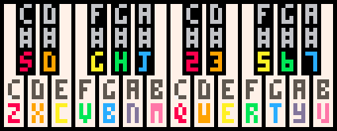

# PICO-8 Audio

## What PICO-8 audio is

A PICO-8 cartridge has 64 SFX slots. Each SFX contains 32 notes**, and each note stores pitch, instrument, volume, and effect. Each SFX also has a speed (SPD) plus loop start / loop end values. If only the first loop value is set and the second is `0`, PICO-8 treats it as a length (LEN) instead of a loop. 

PICO-8 audio work happens in two places:

* **SFX Editor**: used to design sounds and also to write note sequences.
* **Music Editor**: used to arrange SFX into songs across the four audio channels. 

## SFX Editor essentials

There are two SFX editing modes:

* **Pitch mode**: better for sketching sound effects by drawing pitches.
* **Tracker mode**: better for entering music note-by-note. You can toggle modes with `TAB`. 

In **tracker mode**, each note shows:

* frequency
* octave
* instrument
* volume
* effect 

To enter notes in tracker mode, use the piano-style keyboard layout:
`q2w3er5t6y7ui`  
`zsxdcvgbhnjm`   

Useful controls:

* `SPACE` play / stop
* `SHIFT-SPACE` play from the current quarter of the SFX
* `-` and `+` change the current SFX
* `<` and `>` change speed
* `BACKSPACE` deletes a note
* `CTRL-C` / `CTRL-V` copy and paste selected note data 

## Effects and filters

Built-in note effects:

* `0` none
* `1` slide
* `2` vibrato
* `3` drop
* `4` fade in
* `5` fade out
* `6` arpeggio fast
* `7` arpeggio slow 

Tracker-mode filters:

* NOIZ
* BUZZ
* DETUNE-1
* DETUNE-2
* REVERB
* DAMPEN 

These matter because much of the character of PICO-8 sound comes from combining a simple instrument with effects, speed changes, and filter switches. 

## Music Editor essentials

PICO-8 music is built from patterns. Each pattern is a set of four SFX numbers, one for each channel. Playback normally moves to the next pattern, but you can control flow with:

* loop start
* loop back
* stop

A pattern ends when the left-most non-looping channel finishes. This is important for creating odd phrase lengths, double-time rhythms, and polyrhythmic effects. For shorter phrases such as 3/4, use the LEN trick in the SFX editor.

## Custom instruments

Beyond the 8 built-in instruments, PICO-8 also supports:

* SFX instruments using SFX 0–7
* waveform instruments using custom 64-byte looping waveforms in those same slots 

This is one of the most important advanced topics for music making in PICO-8, because it lets you build richer timbres and evolving sounds instead of relying only on the default instruments.

## Useful code

```lua
sfx(0)            -- play sound effect 0
sfx(3, 1)         -- play sfx 3 on channel 1
sfx(-1, 1)        -- stop channel 1
music(0)          -- start music at pattern 0
music(-1)         -- stop music
music(0, 1000)    -- fade in over 1 second
music(0, 0, 7)    -- reserve channels 0,1,2 for music
```

The `channel_mask` in `music()` reserves channels for music playback, although `sfx()` can still use a reserved channel when you explicitly name that channel. 

## A good beginner workflow

1. Make a few short sounds in theSFX editor.
2. Switch to tracker mode to enter simple melodies and drum patterns.
3. Use the Music editor to arrange those SFX into patterns.
4. Add effects, filters, and speed changes*for variation.
5. Export audio with `EXPORT FOO.WAV` (`FOO` is a placehodler name for whatever name you want to use) if you want a WAV file of the current SFX or current music pattern. 

## Beginner tip

If you are not comfortable with music theory, use pitch mode with CTRL held dow* to snap notes to the current scale. By default this is C minor pentatonic, and the scale can be changed in the scale editor. 

## Practice exercise

Create:

* one jump sound
* one hit sound
* one 4-beat drum loop
* one 8-note melody
* one 4-pattern song using loop start and loop back


## Virtual Keyboard by neko250

  
[https://neko250.github.io/pico8-api]

## Tutorials
[Audio System Tutorials](https://www.youtube.com/playlist?list=PLjZAika8vyZkyOjoCp0EbHeIFZ8MLlhvg) by [Matt Tuttle](https://www.youtube.com/user/HeardTheWord13)  
[Pico-8 Music Tutorials](https://www.youtube.com/playlist?list=PLur95ujyAigsqZR1aNTrVGAvXD7EqywdS) by [Gruber](https://www.youtube.com/channel/UCegheZHIpMbFwxbY4jrc8DA)  

## Neat Music and SFX Carts

[Nine Songs in Pico-8](https://www.lexaloffle.com/bbs/?tid=2619). 
[midilib - a bunch of custum instruments](https://www.lexaloffle.com/bbs/?cat=7#tag=midilib). 
[Pico-8 SFX Pack!](https://www.lexaloffle.com/bbs/?pid=141683). 
